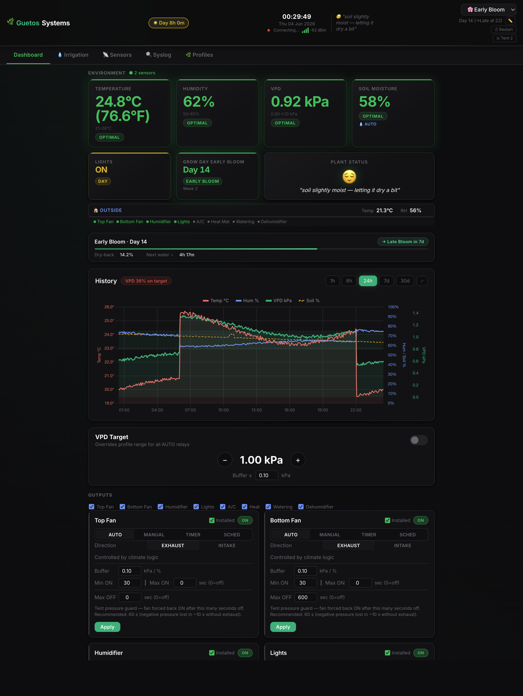

# VPD Grow Room Climate Controller

An ESP32-based, fully autonomous climate controller for an indoor grow room. It
reads temperature, humidity and soil moisture, computes **VPD (Vapour Pressure
Deficit)**, and drives fans, a humidifier, a dehumidifier, a heat mat, lights,
A/C and irrigation to keep the grow room inside a target range — all from a live web
dashboard, with no cloud dependency.

> Runs entirely on a ~$5 microcontroller. Real-time control loop, embedded web
> UI, and over-the-air firmware updates — no Raspberry Pi, no external server.

---

## Highlights

- **VPD-based climate control** — temperature + humidity are combined into VPD
  and regulated with asymmetric hysteresis and per-stage day/night targets.
- **Grow-stage profiles** — Seedling → Vegetative → Early Bloom → Late Bloom →
  Drying, each with its own targets, photoperiod and irrigation schedule. Stages
  auto-advance on an NTP-backed clock.
- **Precision irrigation** — pulse/soak watering with substrate profiles (soil,
  coco, perlite) and dry-back targets, logged to flash.
- **Live web dashboard** — single-page UI served straight from the ESP32, with
  WebSocket telemetry pushed every 2 s. Charts the last 24 h of history.
- **8-channel relay control** — top/bottom fans, humidifier, dehumidifier, heat
  mat, lights, watering, A/C — each with minimum on/off timers and interlocks.
- **Resilient by design** — dual-core FreeRTOS, non-blocking 100 ms control
  loop, hardware watchdog, NVS-persisted settings, brown-out-safe scheduling.
- **Remote-friendly** — over-the-air (OTA) firmware updates, optional DuckDNS
  dynamic DNS, and HTTP Basic Auth for connections from outside the LAN.
- **No cloud, no account** — everything runs on the device; your data never
  leaves your network.

## Screenshots



*Live dashboard: sensor cards (T / RH / VPD / soil), grow-stage progress, 24 h
history chart, VPD target and per-relay controls — served straight from the
ESP32.*

A full wiring diagram is included: [`wiring_diagram.svg`](wiring_diagram.svg).

---

## Architecture

```
            ┌──────────────────────── ESP32 ────────────────────────┐
            │                                                        │
  Sensors ──┤  Core 0: control task (FreeRTOS, ~100 ms tick)         │
  AM2301    │    sensor read → rolling average → VPD → relay logic   │
  DHT11     │                                                        ├── 8× Relays
  Soil ADC  │  Core 1: WiFi · AsyncWebServer · WebSocket broadcast   │   (fans, RH,
  WiFi nodes│    serves gzip-embedded SPA · OTA · NVS/LittleFS I/O   │    heat, A/C,
            │                                                        │    lights, pump)
            └────────────────────────────────────────────────────────┘
                         │                         │
                  Web dashboard            logs.csv / irrig.csv
                 (browser, LAN)             (LittleFS, 7-day history)
```

- **Core 0** runs the deterministic control loop: sensors, VPD math, and all
  relay decisions on a `millis()` state machine (no blocking `delay()`).
- **Core 1** handles networking, the web server, WebSocket broadcast and
  deferred flash writes, so I/O never stalls the control loop.
- The web UI is a single HTML file, gzip-compressed and embedded in the firmware
  image — no filesystem upload needed to update the UI.

## Tech stack

`C++` · `ESP32` · `PlatformIO` · `Arduino framework` · `FreeRTOS` ·
`ESPAsyncWebServer` · `WebSocket` · `LittleFS` · `NVS / Preferences` ·
`ArduinoOTA` · HTML/CSS/JS (vanilla SPA)

## Hardware

| Function            | Component                         | GPIO |
|---------------------|-----------------------------------|------|
| Grow Room T/RH sensor    | AM2301 (DHT22-compatible)         | 4    |
| Intake/room sensor  | DHT11                             | 16   |
| Soil moisture       | Capacitive probe (ADC1)           | 35   |
| Relay 1 — Top fan   | 8-channel relay board             | 26   |
| Relay 2 — Bottom fan|                                   | 27   |
| Relay 3 — Humidifier|                                   | 14   |
| Relay 4 — Lights    |                                   | 22   |
| Relay 5 — Dehum/A-C |                                   | 25   |
| Relay 6 — Heat mat  |                                   | 33   |
| Relay 7 — Watering  |                                   | 32   |
| Relay 8 — Spare     |                                   | 13   |

Exact pin assignments live in [`src/config.h`](src/config.h); wiring is in
[`wiring_diagram.svg`](wiring_diagram.svg).

---

## Getting started

### Prerequisites
- [PlatformIO](https://platformio.org/) (CLI or VS Code extension)
- An ESP32 dev board + the hardware above

### 1. Configure your secrets
Credentials are kept out of version control. Copy the template and fill it in:

```bash
cp src/secrets.h.example src/secrets.h
# then edit src/secrets.h with your WiFi SSID/password, web-auth and OTA password
```

`src/secrets.h` is gitignored and is **never** committed.

### 2. Build & flash (first time, over USB)
```bash
pio run -e esp32dev --target upload      # firmware
pio run -e esp32dev --target uploadfs    # web UI / filesystem (cable only)
```

### 3. Subsequent updates (over the air)
Once the device is on WiFi, set its IP in `platformio.ini`, export the OTA
password (kept out of the repo), and flash wirelessly:

```bash
export VPD_OTA_PASSWORD=your-ota-password   # must match OTA_PASSWORD in secrets.h
pio run -e ota --target upload
```

The web UI is embedded in the firmware, so OTA firmware uploads also update the
dashboard. Open `http://<device-ip>/` in any browser on your network.

---

## Project structure

```
src/            Firmware (C++)
  main.cpp        Boot, WiFi, OTA, dual-core task setup
  climate.cpp/h   VPD calc, grow profiles, light schedule, control logic
  relays.cpp/h    Relay driver: hysteresis, min on/off timers, interlocks
  sensors.cpp     DHT pipeline + rolling average
  webserver.cpp   AsyncWebServer routes + WebSocket
  config.h        Pin map, timing, tunables (non-secret)
  secrets.h       Credentials (gitignored — copy from secrets.h.example)
data/index.html   Single-page web dashboard (source of the embedded UI)
scripts/          build_html.py — gzips index.html into src/ui_html.h
wiki/             In-depth docs (architecture, hardware, flashing)
wiring_diagram.svg
```

See [`wiki/`](wiki/) for the full knowledge base — architecture, hardware
reference, climate logic and the flash procedure.

## License

Released under the [MIT License](LICENSE) — free to use, modify and distribute.
